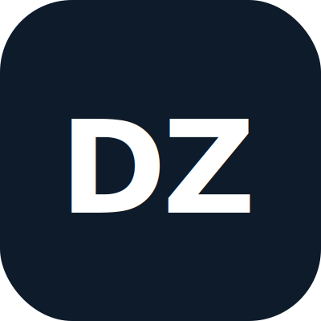

<p align="center">
  
</p>

<h3 align="center">AI Compliance · Infrastructure · Solutions</h3>

<p align="center">
  Helping businesses adopt artificial intelligence<br>
  in a way that is <b>legal</b>, <b>private</b>, and <b>genuinely useful</b>.
</p>

<p align="center">
  <a href="https://daazlabs.com">Website</a> ·
  <a href="https://daazlabs.com/services/">Services</a> ·
  <a href="https://daazlabs.com/contact/">Contact</a> ·
  <a href="https://daazlabs.com/ai-compliance/">Blog</a>
</p>

---

### What We Do

We build and operate AI systems that comply with European regulation — on your infrastructure, under your control.

| | |
|---|---|
| **AI Compliance** | EU AI Act readiness, risk classification, documentation & GDPR alignment |
| **AI Infrastructure** | Local AI deployment, autonomous agents & private model hosting |
| **AI Solutions** | Custom AI tools, workflow automation & strategic consulting |

---

### Why It Matters

| | |
|---|---|
| **EU AI Act** | Active regulation across all European companies |
| **3%** | Max fine as share of annual turnover (Art. 99) |
| **Local AI** | Deploy on your hardware, full data sovereignty |
| **Agents** | Autonomous agents redefining how businesses operate |

---

## Projects

### DAAZLABS — Compliance Audit Platform

EU AI Act & GDPR compliance audit platform. A specialised AI agent analyses businesses in 5 questions, classifies risk, generates professional PDF reports, and delivers them via web or Telegram bot.

`Python` `FastAPI` `DeepSeek` `FAISS RAG` `Telegram Bot` `PDF Reports` `Stripe`

---

### DAAZNEXUS — Multi-Provider AI Chat

AI chat platform aggregating 30+ LLM providers with intelligent routing and automatic failover. Available as a web app ([chat.daazlabs.com](https://chat.daazlabs.com)) and a desktop app with local tool execution.

`Python` `FastAPI` `React` `TypeScript` `Vite` `WebSockets` `SQLite` `Docker`

**Features:** Provider Router · Key Vault Encryption · Cost Analytics · Desktop Mode (file/bash/grep) · Telegram Integration

---

### DAAZLEARN — AI English Learning Platform

Virtual English teacher ("Prof. Sofia") powered by AI. Adaptive conversations, speech recognition, spaced repetition of errors, full A1-C1 curriculum, real-time voice via WebRTC, and progress dashboards.

`Python` `FastAPI` `DeepSeek` `LiveKit` `Whisper (GPU)` `Fish Audio` `Supabase`

**Features:** Animated SVG Avatar · Adaptive Progression · Self-hosted Whisper STT · Placement Tests · Cost Analytics

---

### DAAZLEADS — Lead Intelligence Platform

Portuguese business database for commercial prospecting. Collects data from government portals, enriches and deduplicates, scores leads, and provides advanced search across 9 sectors.

`Python` `FastAPI` `PostgreSQL` `Next.js` `TypeScript` `Docker`

**Features:** Canonical Company Model · Full-text Search · RGPD-compliant Provenance · 30+ Data Sources · Sector Inference

---

### DAAZVOICE — Telephone AI Agent Platform

AI-powered telephone agents speaking European Portuguese. Smart routing between fast and heavy models, RAG integration, EU AI Act Article 50 compliant AI disclosure.

`Python` `FastAPI` `ElevenLabs` `Ollama` `llama.cpp` `FAISS RAG`

**Features:** PT-PT Voice Synthesis · Smart Model Routing · Real-time Latency Measurement · Compliance-first Design

---

### DAAZRECOVER — Vendor Recovery Management

Commercial credit recovery platform replacing fragmented Excel/PDF/email workflows. Automatic reconciliation, global search, age-based alerts, multi-tenant architecture.

`PostgreSQL` `NocoDB` `Python` `Metabase` `MinIO` `Docker`

**Features:** Automatic Reconciliation Engine · Multi-tenant Design · Dashboards · Fuzzy Matching · Licensing Model

---

### Plugins

| Plugin | Description |
|--------|-------------|
| [NewsSync](https://daazlabs.com/newssync/) | AI-powered news aggregation & sync |
| [Global Market Prices](https://daazlabs.com/global-market-prices/) | Real-time market data & pricing intelligence |

---

### Our Approach

```
1. AI Compliance Audit
   Our specialised AI agent analyses your business in minutes —
   mapping exposure, classifying risk, identifying obligations.

2. Tailored Roadmap
   A clear, actionable plan — compliance steps, infrastructure
   options or both — built around your specific situation.

3. Implementation & Support
   We deploy, document and maintain everything together —
   remotely or on-site.
```

---

### Tech Stack

```
Languages    Python · TypeScript · JavaScript
Backend      FastAPI · PostgreSQL · SQLite · WebSockets
Frontend     React · Next.js · Vite · TailwindCSS
AI/ML        DeepSeek · Ollama · llama.cpp · Whisper · FAISS
Voice        LiveKit · ElevenLabs · Fish Audio
Infra        Docker · systemd · Cloudflare Tunnel · NocoDB
Data         Supabase · Metabase · MinIO
Payments     Stripe · WooCommerce
```

---

### Get in Touch

<p align="center">
  <b>Website:</b> <a href="https://daazlabs.com">daazlabs.com</a><br>
  <b>Email:</b> info@daazlabs.com<br>
  <b>Contact:</b> <a href="https://daazlabs.com/contact/">daazlabs.com/contact</a><br>
  <b>Hours:</b> Monday – Friday, 9h – 18h (GMT)
</p>

---

<p align="center">
  
</p>

<p align="center">
  <i>Helping businesses adopt AI — the right way.</i>
</p>
